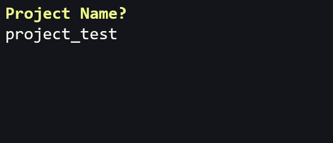
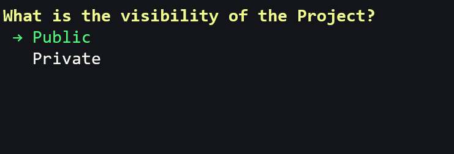
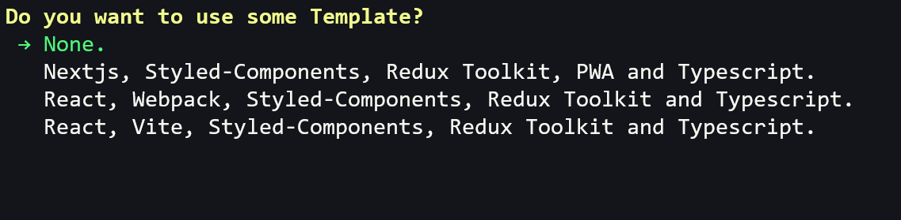
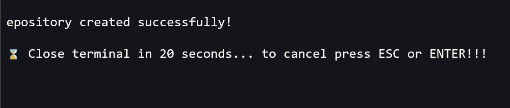
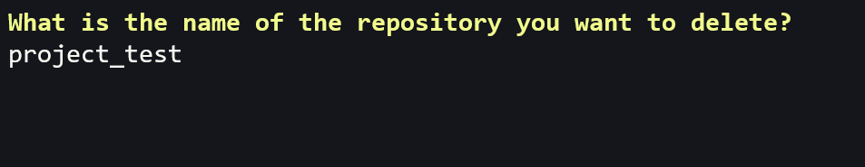
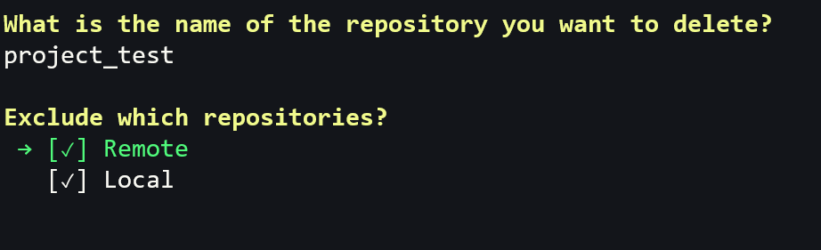
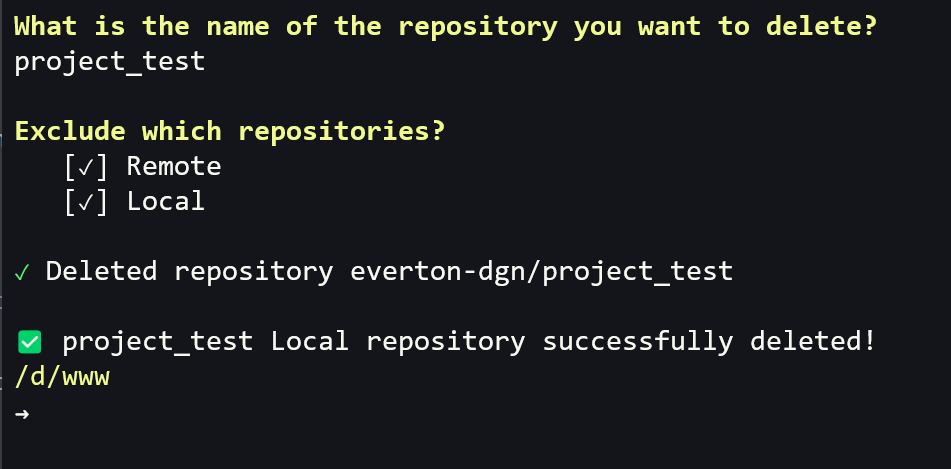

<div align="center">

<a href="./LICENSE"></a>

</div>

<h1 align="center">Script for creating and deleting GitHub repositories via command line</h1>


# :memo: About the Project

This project consists of a script to facilitate the creation and deletion of repositories on GitHub and locally on the PC. 

<br />

---

# :pushpin: Contents

- [Features](#triangular_flag_on_post-features)
- [Prerequisites](#white_check_mark-prerequisites)
- [How to use and to set up the Project](#question-how-to-use-and-to-set-up-the-project)
  - [Clone Repository](#clone-repository)
  - [Configuring the script](#configuring-the-script)
  - [Creating local and remote repository on GitHub](#creating-local-and-remote-repository-on-github)
  - [Deleting local and remote repository on GitHub](#deleting-local-and-remote-repository-on-github)
  - [Customizing the local directory path](#customizing-the-local-directory-path)
  - [Customizing the available templates](#customizing-the-available-templates)
- [Author](#technologist-author)

<br />

---

# :triangular_flag_on_post: Features

- [x] Create local and GitHub repositories with the desired name;

- [x] Offers option to create public or private repository;

- [x] Allows you to create the empty repository or from some template;

- [x] After creating the repositories, close the terminal after 20 seconds or just enter the folder of the local repository created, if the `ESC` or `ENTER` key is pressed;

- [x] Deletes without confirmation any local repository, any remote repository on GitHub, or both simultaneously.

- [x] After creating the repository, it opens the project folder in Visual Studio Code automatically.

<br />

---

# :white_check_mark: Prerequisites

- [GitHub CLI](https://cli.github.com/);

- For Windows, [Git Bash](https://git-scm.com/downloads) or WSL;
  
- For Linux or Mac, terminal in Shell Script.


<br />

---

# :question: How to use and to set up the Project

## Clone Repository

```bash
git clone https://github.com/everton-dgn/script_to_create_and_delete_repositories.git
```

## Configuring the script

- Copy the `functions_bash.sh` file and paste it in any folder. 
- In the example the file was copied and pasted in the user folder.
- To find the user's folder use the command `cd` to enter it and then `pwd` to show the path of the current directory.
- Locate the Bash configuration file in the user folder.
- `.bash_profile` (if using Windows) or `.bashrc` (if using Linux or Mac).
- In the Bash configuration file, first of all import the `functions_bash.sh` file.
- Importing the `functions_bash.sh` file looks like this if the file is in the user's folder:
  ```shell
  source ~/.functions_bash.sh
  ```
- Reopen the Bash terminal and run the command `create_repository` or `delete_repository`.

## Creating local and remote repository on GitHub

<br />



<br />
<br />



<br />
<br />



<br />
<br />



<br />
<br />

## Deleting local and remote repository on GitHub

<br />



<br />
<br />



<br />
<br />



<br />
<br />

## Customizing the local directory path

To customize the path of the directory where the local repositories are, change lines 336, 337 and 372 of the `.functions_bash.sh` file.

## Customizing the available templates

On line 311, inside the `options` array, you can pass the names of the templates (GitHub repositories marked as templates) that you want to use when creating a repository.

On line 321, change the conditional block that refers to each position in the `options` array. 

Inside the conditional blocks, in the `use_template` variable you must insert, after the `--template` property, the exact name of the template (which corresponds to the name of the template repository on GitHub).

For the first position of the array (key 0) it was chosen to leave the option `None.`, so that if selected, the variable `use_template` will have an empty string value and thus, no template will be added when creating the repository, leaving it completely empty.

---

# :technologist: Author

By [Éverton Toffanetto](https://programadordesucesso.com).

:link: LinkedIn: https://www.linkedin.com/in/everton-toffanetto

:link: YouTube: https://www.youtube.com/c/ProgramadordeSucesso

:link: Site: https://programadordesucesso.com
